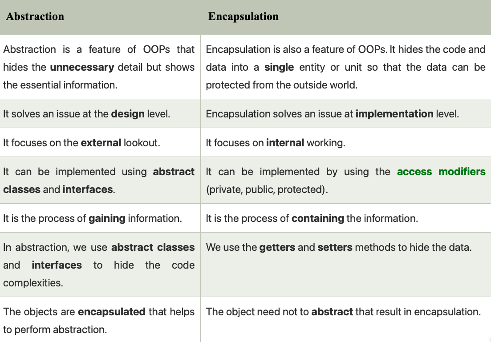

### What is Abstraction?
* Data abstraction is the process of hiding certain details and showing only essential information to the user.
  Abstraction can be achieved with either **abstract** classes or **interfaces** 
* It hides the unnecessary code details from the user. Also,  when we do not want to give out sensitive parts of our code implementation and this is where data abstraction came.

* Abstraction refers to hiding the internal implementation of the feature and only showing the functionality to the users.
* Only **classes** and **methods** can be abstracted.
* You cannot create abstract **constructor**.
* You cannot create object of an Abstract class, but you can use them as a Reference variable.

* In java, abstraction is achieved by interfaces and abstract classes. 
  * We can achieve 100% abstraction using interfaces.
  * We can achieve 0-100% abstraction using abstract class.

* The abstract keyword is a non-access modifier, used for classes and methods
  * **Abstract class**: is a restricted class that cannot be used to **create objects** (to access it, 
    it must be inherited/extend from another class).
  * **Abstract method**: can only be used in an abstract class, 
    and it does not have a body. The body is provided by the subclass (inherited from).
  
* An abstract class can have both abstract and regular methods.
* If you extend an abstract class / interface you have to use all it's abstract methods.Or you have to declare the sub-class abstract itself.
* Members of a Java interface are public by default. 
* A Java abstract class can have class members like private, protected, etc.
* * **Example**: Consider a real-life example of a man driving a car. The man only knows that pressing the accelerators will increase the speed of a car or applying brakes will stop the car, but he does not know how on pressing the accelerator the speed is actually increasing, he does not know about the inner mechanism of the car or the implementation of the accelerator, brakes, etc in the car. This is what abstraction is.

### Abstract classes and Abstract methods :
  * An abstract class is a class that is declared with an abstract keyword.
  * An abstract method is a method that is declared without implementation.
  * An abstract class may or may not have all abstract methods. Some of them can be concrete methods
  * A method-defined abstract must always be redefined in the subclass, thus making overriding compulsory or making the subclass itself abstract.
  * Any class that contains one or more abstract methods must also be declared with an abstract keyword.
  * There can be no object of an abstract class. That is, an abstract class can not be directly instantiated with the new operator.
  * An abstract class can have parameterized constructors and the default constructor is always present in an abstract class.
  * If you extend an abstract class/interface you have to use all it's abstract methods.Or you have to declare the sub-class abstract itself.

#### When to use abstract classes and abstract methods with an example
* There are situations in which we will want to define a superclass that declares the structure of a given abstraction without providing a complete implementation of every method. Sometimes we will want to create a superclass that only defines a generalization form that will be shared by all of its subclasses, leaving it to each subclass to fill in the details.
  Consider a classic “shape” example, perhaps used in a computer-aided design system or game simulation. The base type is “shape” and each shape has a color, size, and so on. From this, specific types of shapes are derived(inherited)-circle, square, triangle, and so on — each of which may have additional characteristics and behaviors. For example, certain shapes can be flipped. Some behaviors may be different, such as when you want to calculate the area of a shape. The type hierarchy embodies both the similarities and differences between the shapes.

### Advantages of Abstraction
* It reduces the complexity of viewing things.
* Avoids code duplication and increases reusability.
* Helps to increase the security of an application or program as only essential details are provided to the user.
* It improves the maintainability of the application.
* It improves the modularity of the application.
* The enhancement will become very easy because without affecting end-users we can perform any type of changes in our internal system. 

#### Encapsulation vs Data Abstraction
* Encapsulation is data hiding(information hiding) while Abstraction is detailed hiding(implementation hiding).
* While encapsulation groups together data and methods that act upon the data, data abstraction deal with exposing the interface to the user and hiding the details of implementation.
* Encapsulated classes are java classes that follow data hiding and abstraction while We can implement abstraction by using abstract classes and interfaces.
* Encapsulation is a procedure that takes place at the implementation level, while abstraction is a design-level process.
* 
### Abstraction Important Resources.
* <a href="https://www.geeksforgeeks.org/abstraction-in-java-2/">Abstraction in Java</a>
* <a href="https://www.w3schools.com/java/java_abstract.asp">Java Abstraction</a>
* [Abstraction in python](https://www.geeksforgeeks.org/abstract-classes-in-python/)
* [Interface module python](https://www.geeksforgeeks.org/python-interface-module/)
* [Data hiding in python](https://www.geeksforgeeks.org/object-oriented-programming-in-python-set-2-data-hiding-and-object-printing/)
* <a href="https://www.youtube.com/watch?v=XUvnPcnYsHM">Java Abstraction theory - Anisul islam</a>
* <a href="https://www.youtube.com/watch?v=P_Yb5CQFh3Y">Java Abstraction practical - Anisul islam</a>

### What is Interface?
* An Interface in Java programming language is defined as an abstract type used to specify the behavior of a class.
  An interface in Java is a blueprint of a class. A Java interface contains static constants and abstract methods.
* **The interface in Java is a mechanism to achieve abstraction** and multiple inheritance.
* There can be only abstract methods in the Java interface, not the method body.
* Interface can only have static and final variable.

### Notes on Interfaces:
* Like abstract classes, interfaces **cannot be used to create objects** .
* **Interface methods** do not have a body - the body is provided by the "implement" class.
* **Static Interface methods** must have a body.
* On implementation of an interface, you **must override** all of its methods
* Interface methods are by default **abstract** and **public**
* Interface attributes are by default **public**, **static** and **final**
* An interface cannot contain a **constructor** (as it cannot be used to create objects).
* We should not use interface in performance critical programs as all of their functionalities happens at runtime.

#### Why And When To Use Interfaces?
* To achieve security - hide certain details and only show the important details of an object (interface).
* Java does not support "multiple inheritance" (a class can only inherit from one superclass). However, it can be achieved with interfaces, because the class can implement multiple interfaces. Note: To implement multiple interfaces, separate them with a comma (see example below).

### Interface Important resources.
* <a href="https://www.geeksforgeeks.org/interfaces-in-java">Interfaces in Java - important</a>
* <a href="https://www.w3schools.com/java/java_interface.asp">Java Interfaces</a>
* <a href="https://www.youtube.com/watch?v=ksj96Q8XVh4">Intro to interface</a>
* <a href="https://www.youtube.com/watch?v=vsO0HLu7zaM">Why interface support multiple inheritance?</a>
* <a href="https://www.youtube.com/watch?v=LNDOlSOa_B4">Difference Between Abstract Class And Interface</a>
* <a href="https://www.geeksforgeeks.org/difference-between-abstract-class-and-interface-in-java/">Difference between abstract class and interface - Important.</a>